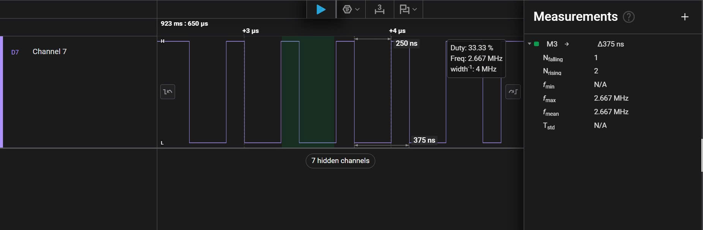
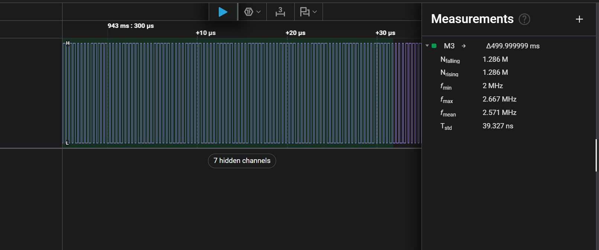
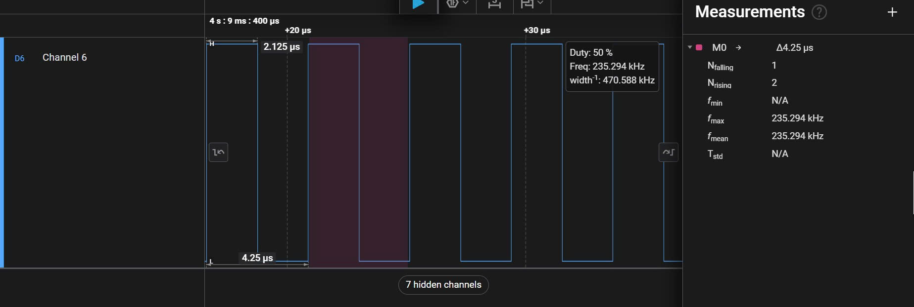
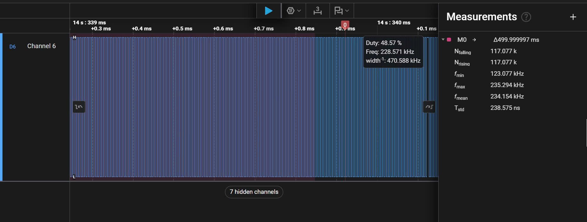
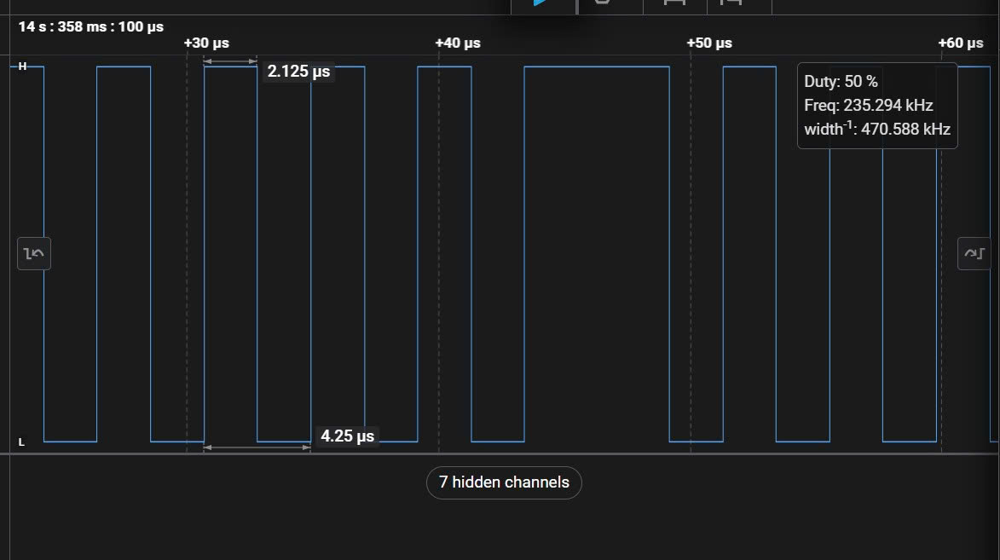

# Báo Cáo Thực Nghiệm: So Sánh Hiệu Năng GPIO Giữa Thư Viện HAL và Thao Tác Thanh Ghi Trực Tiếp (CMSIS/LL)

* **Sinh viên thực hiện:** chutxing
* **Phần cứng thử nghiệm:** Kit phát triển STM32F103C8T6 (Blue Pill)
* **Tần số xung nhịp hệ thống ($SYSCLK$):** 8 MHz (Internal HSI / HSE Bypass)
* **Thiết bị & Phần mềm đo lường:** Saleae Logic Analyzer (Saleae Logic 2 Software)
* **Đối tượng đo:** Chân `PC13` (Tích hợp LED trên board, cấu hình Output Push-Pull, Max Speed 50MHz)

---

## 1. Phương Pháp Thực Nghiệm & Cấu Hình

Thực hiện viết chương trình điều khiển lật trạng thái chân GPIO (Toggle Pin) liên tục trong vòng lặp vô tận `while(1)` không chèn hàm delay bằng 2 phương pháp:
1. **Thư viện STM32 HAL:** Sử dụng hàm chuẩn `HAL_GPIO_TogglePin(GPIOC, GPIO_PIN_13)`.
2. **Thao tác Thanh ghi (Register Level / LL):** Can thiệp trực tiếp thanh ghi output `GPIOC->ODR ^= (1U << 13)`.

Tiến hành thu thập dữ liệu trên phần mềm **Saleae Logic 2** ở 2 mốc kiểm thử:
* **Khảo sát đơn chu kỳ (1 Period):** Xác định chu kỳ nhỏ nhất ($T$), độ rộng xung ($Width$), và tần số tức thời cực đại ($f$).
* **Khảo sát khoảng thời gian thực 500ms:** Đánh giá số lượng chu kỳ hoàn thành, tần số trung bình ($f_{\text{mean}}$) và tính ổn định của luồng thực thi.

---

## 2. Kết Quả Đo Lường & Đánh Giá Dạng Sóng

### 2.1. Thao tác Thanh ghi trực tiếp (Register-level / LL)

* **Dạng sóng 1 chu kỳ hoàn chỉnh:**
  
  * Chu kỳ thực thi ($T$): Rất ngắn (~ $375\text{ ns} - 500\text{ ns}$).
  * Tần số tức thời ($f$): Đạt mức cao từ $2.00\text{ MHz}$ đến $2.67\text{ MHz}$.

* **Dạng sóng khảo sát trong 500ms:**
  
  * Xung duy trì liên tục và đồng đều tuyệt đối trên toàn bộ dải thời gian 500ms, không xuất hiện hiện tượng gián đoạn hay méo chu kỳ.

---

### 2.2. Thao tác qua Thư viện STM32 HAL

* **Dạng sóng 1 chu kỳ hoàn chỉnh:**
  
  * Chu kỳ thực thi ($T$): Dãn dài lên mức $4.25\ \mu\text{s}$ ($4250\text{ ns}$).
  * Tần số trung bình ($f_{\text{mean}}$): Đạt khoảng $235.29\text{ kHz}$.

* **Dạng sóng khảo sát trong 500ms:**
  
  * Mật độ xung thưa hơn đáng kể so với thao tác thanh ghi trong cùng một đơn vị thời gian.

---

### 2.3. Phân Tích Hiện Tượng Dị Thường Xung Trên Thư Viện HAL (SysTick Jitter)

Trong quá trình thu mẫu tín hiệu của bản HAL, xuất hiện hiện tượng một số chu kỳ xung bị **kéo dài bất thường** (độ rộng xung vọt lên tới $5.75\ \mu\text{s}$ thay vì $2.125\ \mu\text{s}$ như các chu kỳ thông thường).

* **Cơ chế kỹ thuật:** 
  * Khi khởi tạo hệ thống bằng `HAL_Init()`, thư viện HAL mặc định kích hoạt bộ định thời lõi **Cortex-M SysTick Timer** với ngắt định kỳ chu kỳ **$1\text{ ms}$ ($1\text{ kHz}$)**.
  * Mỗi khi ngắt SysTick kích hoạt, CPU bị chiếm quyền điều khiển (Preemption) để nhảy vào thực thi trình phục vụ ngắt `SysTick_Handler()` nhằm gọi hàm `HAL_IncTick()` tăng biến đếm `uwTick`.
  * Quá trình lưu ngữ cảnh (Context Switching / Push Stack), thực thi mã ngắt và khôi phục ngữ cảnh (Pop Stack) chiếm dụng một lượng chu kỳ CPU nhất định, làm vòng lặp `while(1)` bị trì hoãn tạm thời ngay tại thời điểm chân `PC13` đang ở mức logic hiện tại, tạo ra hiện tượng xung bị phình to (Timing Jitter).
* **Kết luận hiện tượng:** Bản chất đây là hoạt động quản lý thời gian cơ sở ngầm của HAL, không phải lỗi phần cứng.

---

## 3. Bảng Tổng Hợp Số Liệu So Sánh

| Tiêu chí khảo sát | Thao tác Thanh ghi (LL/CMSIS) | Thư viện STM32 HAL | Chênh lệch / Đánh giá |
| :--- | :--- | :--- | :--- |
| **Chu kỳ xung đơn ($T$)** | **$375 - 500\text{ ns}$** | **$4.25\ \mu\text{s}$** | HAL trễ gấp ~ **8.5 - 11.3 lần** |
| **Tần số Toggle trung bình ($f$)** | **$2.00 - 2.67\text{ MHz}$** | **$235.29\text{ kHz}$** | Thanh ghi nhanh hơn ~ **1000%** |
| **Số chu kỳ lệnh CPU / lần Toggle** | ~ $3 - 4$ clock cycles | ~ $150 - 170$ clock cycles | HAL tiêu tốn tài nguyên gấp ~ **40 - 50 lần** |
| **Độ ổn định dạng sóng (Jitter)** | Tuyệt đối (100% đồng dạng) | Xuất hiện Jitter mỗi $1\text{ ms}$ | Do ngắt ngầm `SysTick_Handler` của HAL |
| **Overhead mã nguồn** | Không có (biên dịch inline ASM) | Gọi hàm (`BL`), kiểm tra biến, push/pop stack | Thao tác thanh ghi tối ưu hóa phần cứng triệt để |
| **Tính trừu tượng & Khả chuyển** | Thấp (phụ thuộc họ vi điều khiển) | Rất cao (dễ dàng chuyển đổi F1, F4, G0...) | HAL chiếm ưu thế trong phát triển nhanh |

---

## 4. Kết Luận Chung

1. **Về mặt hiệu năng:** Thao tác thanh ghi trực tiếp cho tốc độ thực thi vượt trội hoàn toàn, giảm thiểu độ trễ I/O đến mức tối đa của phần cứng ($SYSCLK = 8\text{MHz}$). Phù hợp tối đa cho các ứng dụng thời gian thực khắt khe (Real-time Critical), giả lập giao thức bit-banging (1-Wire, WS2812B, SPI mềm) hoặc viết driver ngoại vi tốc độ cao.
2. **Về mặt công thái học phần mềm:** Thư viện HAL đánh đổi hiệu năng xử lý chu kỳ xung nhịp để đem lại tính toàn vẹn hệ thống, cung cấp cơ chế timeout an toàn, đồng bộ thời gian chuẩn xác và tính linh động (Portability) giữa các dòng vi điều khiển khác nhau trong hệ sinh thái STM32.
